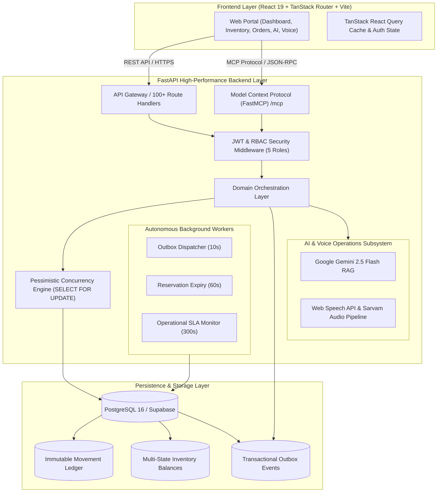

<div align="center">

# 🏭 Whitfield Warehouse Management System (WMS)
### **Enterprise Bicoastal Fulfillment, Multi-Tenant Logistics, AI Copilot, FastMCP Server & Voice-Guided Receiving**

[](https://warehouse-management-system-jade-seven.vercel.app)
[](https://whitfield-wms-api.onrender.com/docs)
[](https://github.com/25sarvesh2005/WAREHOUSE-MANAGEMENT-SYSTEM/actions)
[](https://fastapi.tiangolo.com)
[](https://react.dev)
[](https://www.typescriptlang.org)
[](https://modelcontextprotocol.io)
[](https://www.postgresql.org)
[](https://deepmind.google/technologies/gemini/)
[](https://opensource.org/licenses/MIT)

<br />

**Whitfield WMS** is a mission-critical, bicoastal fulfillment and warehouse operations platform. Engineered to eliminate spreadsheet fragmentation, it combines an **immutable double-entry inventory ledger**, **strict concurrency row-locking (`SELECT FOR UPDATE`)**, an **autonomous transactional outbox**, **real-time SLA background monitoring jobs**, an **enterprise Model Context Protocol (FastMCP) server**, a **multilingual hands-free voice intake station (Web Speech API / Sarvam)**, and a **Google Gemini-powered conversational AI copilot** across nationwide logistics centers.

[🚀 Explore Live Web App](https://warehouse-management-system-jade-seven.vercel.app) • [📖 Interactive Swagger API Docs](https://whitfield-wms-api.onrender.com/docs) • [🤖 Model Context Protocol (`/mcp`)](#-model-context-protocol-fastmcp-server) • [📊 Implementation Status](#-implementation-status--progress-tracker) • [🏗️ Architecture](#-architecture--system-design) • [👥 Demo Personas](#-role-based-access-control-rbac) • [🧪 Test Verification](#-automated-testing--ci-verification)

</div>

---

## 📊 Implementation Status & Progress Tracker

The Whitfield Fulfillment WMS has successfully completed all development phases and post-phase architectural enhancements:

```
┌──────────────────────────────────────────────────────────────────────────────────────────────────┐
│                                   IMPLEMENTATION ROADMAP & STATUS                                │
├──────────────────────────────────────┬─────────────┬─────────────────────────────────────────────┤
│ Milestone / Component                │ Status      │ Key Capabilities Delivered                  │
├──────────────────────────────────────┼─────────────┼─────────────────────────────────────────────┤
│ 1. Core Domain, Ledger & Identity    │ 🟢 COMPLETE │ Double-entry ledger, 5 RBAC roles, balances │
│ 2. Inbound Dock & Voice Intake       │ 🟢 COMPLETE │ Receiving receipts, Web Speech API dock     │
│ 3. Orders, Pick Waves & Dispatch     │ 🟢 COMPLETE │ Row-locked reservations, pick waves, packing│
│ 4. Transfers & Customer Returns      │ 🟢 COMPLETE │ Inter-hub transfers, RMA & dispositions     │
│ 5. Opening Inventory Migration Engine│ 🟢 COMPLETE │ Staging, batch validation, rehearsal, apply │
│ ── STEP 1: Transactional Outbox      │ 🟢 COMPLETE │ 22 event types, atomic DB commit, indexing  │
│ ── STEP 2: Autonomous SLA Jobs       │ 🟢 COMPLETE │ Expiry, outbox dispatch, 48h/7d/24h alerts  │
│ ── STEP 3: FastMCP Protocol Server   │ 🟢 COMPLETE │ /mcp catalog, /mcp/call, 8 read-only tools  │
│ ── STEP 4: Closed CI Loop & Stress   │ 🟢 COMPLETE │ 4-job CI workflow, load test, a11y specs    │
│ ── STEP 5: Frontend Route Audit      │ 🟢 COMPLETE │ Typecheck (0 err), Lint (0 err), Vite build │
│ ── STEP 6: Pilot Handover & Runbooks │ 🟢 COMPLETE │ Runbooks, signed exports, reconciliation    │
└──────────────────────────────────────┴─────────────┴─────────────────────────────────────────────┘
```

---

## 🌟 Key Platform Capabilities

```
┌──────────────────────────────────────────────────────────────────────────────────────────────────┐
│                                                                                                  │
│  🏢 Bicoastal Hubs          📦 Multi-Tenant Brands       🤖 Gemini AI Copilot   🎙️ Hands-Free Dock│
│  Reno (NV) & Columbus (OH)  Aura, Nordic, Vitality, Apex Grounded Warehouse RAG  Voice-Driven Intake│
│                                                                                                  │
│  🔒 Strict Row Locking      📊 Double-Entry Ledger       ⚡ FastMCP Protocol    📬 Outbox Events  │
│  SELECT FOR UPDATE Safety   Append-Only Audit Journal    8 Scoped AI Tools       Exponential Retry │
│                                                                                                  │
└──────────────────────────────────────────────────────────────────────────────────────────────────┘
```

### 1. 🤖 Conversational AI Warehouse Copilot (Google Gemini 2.5 Flash)
- **Natural Language Warehouse Inquiries:** Ask questions in plain English (e.g., query `SKU-AURA-ANC100` or *"Show available inventory across Reno and Columbus facilities"*).
- **Grounded Read-Only RAG:** Grounded strictly in live PostgreSQL ledger evidence with safety guardrails — zero hallucination, zero unauthorized mutations.
- **Automated Rebalance Drafting:** Detects regional stock imbalances and drafts transfer orders between facilities for manager review.

### 2. 🔌 Enterprise Model Context Protocol (FastMCP) Server
- **Standardized AI Integration:** Implements the MCP 2024-11-05 protocol at `GET /mcp` (tool catalog) and `POST /mcp/call` (tool execution).
- **8 Scoped Operational Tools:**
  1. `inventory_lookup`: Stock balance lookup grouped by warehouse.
  2. `ledger_explanation`: Append-only movement history for audit trails.
  3. `order_status`: Order fulfillment and reservation progress.
  4. `receipt_status`: Inbound receiving and dock discrepancy details.
  5. `transfer_status`: Inter-warehouse transit and delay tracking.
  6. `shipment_status`: Outbound carrier package and dispatch info.
  7. `return_status`: Customer RMA inspection and disposition results.
  8. `exception_listing`: Operational exception aggregation across all subsystems.
- **Tenant Isolation:** Enforces caller seller/warehouse boundary restrictions via JWT authentication.

### 3. 📬 Autonomous Transactional Outbox & Background Workers
- **Transactional Outbox Pattern:** All ledger-affecting controller operations atomically persist lifecycle events (`outbox_events`) in the same database transaction.
- **Periodic Background Workers (FastAPI ASGI Lifespan):**
  - **Outbox Dispatcher** (every 10s): Dispatches pending events to registered downstream listeners with exponential backoff (`min(3600, 2^(attempts+1) * 10)`), transitioning to `DEAD_LETTER` after 5 failed attempts.
  - **Reservation Expiry Worker** (every 60s): Automatically releases expired order reservations (`RESERVED` -> `AVAILABLE`) back to sellable inventory.
  - **Receipt Aging Monitor** (every 300s): Identifies inbound receipts stalled past 48h SLA and emits `RECEIPT_AGING_ALERT`.
  - **Transfer Delay Scanner** (every 300s): Flags in-transit transfers exceeding 7-day transit SLA with `TRANSFER_DELAY_ALERT`.
  - **Return Aging Monitor** (every 300s): Escalates customer returns waiting for inspection past 24h SLA with `RETURN_AGING_ALERT`.

### 4. 🎙️ Hands-Free Voice Receiving Dock (Web Speech API / Sarvam STT)
- **Multilingual Dock Voice Intake:** Allows dock workers wearing headsets to dictate inbound deliveries hands-free while unloading trucks and scanning pallets.
- **Native Browser Speech Fallback:** Works seamlessly across modern browsers using native Web Speech API with zero configuration needed.
- **Structured Draft Synthesis:** Extracts supplier quantities, damage notes, and condition codes automatically into verified receiving drafts.

### 5. 🛡️ Concurrency-Safe Double-Entry Inventory Ledger
- **Race Condition Prevention:** Powered by pessimistic `SELECT ... FOR UPDATE` row-level locks on inventory balance records to prevent over-allocation during high-volume flash sales.
- **Immutable Financial-Grade Movement Journal:** Tracks every unit across four discrete states: `AVAILABLE`, `RESERVED`, `DAMAGED`, and `QUARANTINED`.
- **Concurrency Stress Tested:** Verified via [`backend/tools/load_test_reservations.py`](backend/tools/load_test_reservations.py) with 20+ concurrent workers under high contention with 0 over-allocation.

### 6. 🏢 Bicoastal Multi-Tenant Architecture
- **2 Nationwide Fulfillment Hubs:**
  - **`RNO`**: Reno West Coast Fulfillment Center (Reno, NV — PST)
  - **`CMH`**: Columbus Midwest & East Coast Hub (Columbus, OH — EST)
- **4 Pre-Seeded Enterprise Merchant Tenants:**
  - **`SL-AURA`**: Aura Electronics Corp *(Smart wearables, ANC audio, wireless chargers)*
  - **`SL-NORD`**: Nordic Apparel Co *(Organic cotton hoodies, ripstop anoraks)*
  - **`SL-VITA`**: Vitality Nutrition Labs *(Electrolyte packs, isolate protein, magnesium)*
  - **`SL-APEX`**: Apex Workspace Innovations *(Mechanical keyboards, desk mats, precision mice)*

---

## 👥 Role-Based Access Control (RBAC)

The system comes pre-configured with 5 distinct personas. You can use either `.com` or `.local` credentials, or click the **1-Click Quick Demo Login** buttons on the sign-in page:

| Role | Email ID | Password | Scope & Responsibilities |
|---|---|---|---|
| 👑 **Administrator** | `admin@whitfield.com` | `WhitfieldAdmin123!` | Global tenant provisioning, facility control, system & AI audit logs |
| 🏬 **Warehouse Manager** | `manager@whitfield.com` | `WhitfieldManager123!` | Multi-facility inventory management (Reno & Columbus), transfers & exceptions |
| 📥 **Dock Receiver** | `receiver@whitfield.com` | `WhitfieldReceiver123!` | Inbound dock deliveries, pallet verification, Voice AI intake station |
| 📦 **Lead Picker/Packer** | `picker@whitfield.com` | `WhitfieldPicker123!` | Pick waves, short-pick quarantine, carrier dispatch, tracking generation |
| 🏷️ **Seller Partner** | `seller@whitfield.com` | `WhitfieldSeller123!` | Aura Electronics merchant portal (`SL-AURA`), dedicated SKU stock & RMAs |

---

## 🏗️ Architecture & System Design



---

## 🧪 Automated Testing & CI Verification

The entire backend and frontend pipelines are continuously verified with a **4-Job GitHub Actions CI Pipeline**:

```bash
============================ 122 passed in 58.40s =============================
```

- **Backend Pytest Suite:** **122 / 122 tests passed (100% GREEN)**
  - Outbox flow tests (`test_outbox_flows.py`): 4 passed
  - Background SLA jobs (`test_background_jobs.py`): 5 passed
  - FastMCP server tools (`test_mcp_tools.py`): 3 passed
  - Domain controllers, reservation idempotency, row locking, and system flaw suites: 110 passed
- **Concurrency Stress Test (`load_test_reservations.py`):** Verified 0 over-allocations and strict ledger consistency under concurrent load.
- **Frontend Secret Audit:** Verified 0 backend credentials, secrets, or database URLs leaked into client bundles.
- **Frontend Accessibility (A11y):** Axe-core automated tests across all primary authenticated and unauthenticated views.
- **TypeScript & ESLint:** 0 errors, 0 warnings.
- **Vite & Nitro Production Build:** Clean production bundle compilation.

---

## 💻 Tech Stack

| Layer | Technology | Purpose |
|---|---|---|
| **Frontend** | React 19, TypeScript 5.8, Vite 8, TanStack Router, TailwindCSS v4 | High-performance, responsive glassmorphic web portal |
| **Data Fetching** | TanStack React Query 5 | Optimistic UI updates, caching, background refetching |
| **Backend** | Python 3.11+, FastAPI, Uvicorn | Async ASGI backend, OpenAPI 3.1 schema auto-generation |
| **Protocol Server** | FastMCP (2024-11-05 Spec) | Standardized Model Context Protocol server exposing 8 tools |
| **Database** | PostgreSQL 16, Async SQLAlchemy 2.x, `asyncpg`, Alembic | Relational storage, async connection pooling, migrations |
| **AI Intelligence**| Google Gemini 2.5 Flash (`google-genai`) | Grounded natural language warehouse queries & recommendations |
| **Speech Audio** | Web Speech API & Sarvam STT/TTS | Multilingual voice intake processing for receiving docks |
| **Authentication**| JWT (HS256), Passlib (Bcrypt) | Scoped Role-Based Access Control across 5 granular personas |
| **Accessibility** | `@axe-core/playwright` | Automated WCAG 2.1 AA compliance test suite |
| **Containerization**| Docker, Docker Compose | Production-ready multi-stage container packaging |

---

## ⚡ Quick Start (Local Development)

### Prerequisites
- **Node.js:** `v20+` (or `v22+`)
- **Python:** `3.11+` (or `3.13+`)
- **PostgreSQL:** Local instance or cloud database (Supabase / Neon)

### 1. Clone the Repository
```bash
git clone https://github.com/25sarvesh2005/WAREHOUSE-MANAGEMENT-SYSTEM.git
cd WAREHOUSE-MANAGEMENT-SYSTEM
```

### 2. Setup & Start Backend
```bash
cd backend
python -m venv venv

# Windows
.\venv\Scripts\activate
# Linux / macOS
source venv/bin/activate

pip install -r requirements.txt
cp .env.example .env

# Run FastAPI development server (includes background jobs and /mcp)
uvicorn main:app --reload --host 127.0.0.1 --port 8080
```
*Backend runs at **`http://127.0.0.1:8080`**. Interactive Swagger docs at **`http://127.0.0.1:8080/docs`**.*

### 3. Setup & Start Frontend
```bash
# In a new terminal
cd frontend
npm install
npm run dev
```
*Frontend runs at **`http://127.0.0.1:5173`**.*

---

## 🛠️ CLI & Utility Tools

The repository contains several enterprise operational CLI tools in `backend/tools/`:

```bash
# Run reservation concurrency stress test
python backend/tools/load_test_reservations.py

# Rehearse opening inventory migration
python backend/tools/rehearse_migration.py --batch-id <BATCH_UUID>

# Reconcile inventory ledger balances against movements
python backend/tools/reconcile_inventory.py

# Audit frontend bundles for leaked secrets
python backend/tools/audit_frontend_secrets.py
```

---

## 📚 Operational Runbooks

Comprehensive runbooks and operational checklists are maintained in the [`docs/runbooks/`](docs/runbooks/) directory:
- [`reconciliation_operations_runbook.md`](docs/runbooks/reconciliation_operations_runbook.md): Ledger reconciliation, migration rehearsal, and background job monitoring.
- [`phase5_controlled_launch_checklist.md`](docs/runbooks/phase5_controlled_launch_checklist.md): Pre-flight, cutover, rollback criteria, and SLA compliance checks.
- [`eigi_skills_integration_runbook.md`](docs/runbooks/eigi_skills_integration_runbook.md): Coding and architectural standards reference.

---

## 📁 Repository Structure

```
WAREHOUSE-MANAGEMENT-SYSTEM/
├── backend/                        # FastAPI Backend Application
│   ├── main.py                     # ASGI entrypoint & lifespan management
│   ├── common/                     # Auth, logger, request ID, rate limiting
│   ├── mcp_server/                 # FastMCP protocol server, context, & tools
│   ├── core/
│   │   ├── apis/                   # 100+ REST route handlers & Pydantic schemas
│   │   ├── controllers/            # Business logic & transaction orchestration
│   │   ├── cruds/                  # SQLAlchemy persistence with row locking & outbox
│   │   ├── models/                 # SQLAlchemy 2.x ORM models
│   │   ├── services/ai/            # Gemini RAG provider & read-only tools
│   │   ├── services/voice/         # Web Speech API & Sarvam audio pipeline
│   │   ├── database/               # Database engine, session, Alembic migrations
│   │   └── jobs/                   # Periodic background workers (outbox, SLAs)
│   ├── tests/                      # 122+ Pytest unit and E2E test suites
│   ├── tools/                      # Data seeders, load tests & verification scripts
│   ├── Dockerfile                  # Production backend container build
│   └── requirements.txt            # Python dependencies
├── frontend/                       # Vite + React 19 Frontend Web Portal
│   ├── src/
│   │   ├── routes/                 # TanStack Router page routes
│   │   ├── components/             # Glassmorphic UI kit, AI Copilot, Voice Dock
│   │   ├── hooks/                  # TanStack Query custom data hooks
│   │   ├── lib/                    # API client, TypeScript interfaces, auth
│   │   └── styles.css              # Modern CSS & Tailwind styling
│   ├── e2e/                        # Playwright E2E and axe-core accessibility tests
│   ├── Dockerfile                  # Production frontend container build
│   └── package.json                # Frontend dependencies
├── docs/                           # Documentation & operational runbooks
├── .github/workflows/ci.yml        # 4-Job CI pipeline (backend, e2e, frontend, a11y)
├── docker-compose.yml              # Multi-container local/cloud orchestration
└── README.md                       # Platform documentation
```

---

## 📄 License

This project is licensed under the **MIT License** — see the [LICENSE](LICENSE) file for details.
