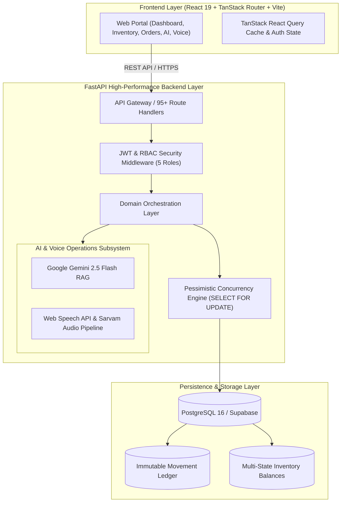

<div align="center">

# 🏭 Whitfield Warehouse Management System (WMS)
### **Enterprise Bicoastal Fulfillment, Multi-Tenant Logistics, AI Copilot & Voice-Guided Receiving**

[](https://warehouse-management-system-jade-seven.vercel.app)
[](https://whitfield-wms-api.onrender.com/docs)
[](https://github.com/25sarvesh2005/WAREHOUSE-MANAGEMENT-SYSTEM/actions)
[](https://fastapi.tiangolo.com)
[](https://react.dev)
[](https://www.typescriptlang.org)
[](https://www.postgresql.org)
[](https://deepmind.google/technologies/gemini/)
[](https://opensource.org/licenses/MIT)

<br />

**Whitfield WMS** is a mission-critical, bicoastal fulfillment and warehouse operations platform. Engineered to eliminate spreadsheet fragmentation, it combines an **immutable double-entry inventory ledger**, **strict concurrency row-locking (`SELECT FOR UPDATE`)**, a **multilingual hands-free voice intake station (Web Speech API / Sarvam)**, and a **Google Gemini-powered conversational AI copilot** across nationwide logistics centers.

[🚀 Explore Live Web App](https://warehouse-management-system-jade-seven.vercel.app) • [📖 Interactive Swagger API Docs](https://whitfield-wms-api.onrender.com/docs) • [🏗️ Architecture](#-architecture--system-design) • [👥 Demo Personas](#-role-based-access-control-rbac) • [🧪 Test Verification](#-automated-testing--ci-verification)

</div>

---

## 🌟 Live Cloud Deployment

| Service | Host | Status | Direct Link |
|---|---|:---:|---|
| **Frontend Web Portal** | Vercel | 🟢 **Live** | [warehouse-management-system-jade-seven.vercel.app](https://warehouse-management-system-jade-seven.vercel.app) |
| **Backend REST API** | Render | 🟢 **Live** | [whitfield-wms-api.onrender.com](https://whitfield-wms-api.onrender.com) |
| **Swagger Interactive Docs** | Render | 🟢 **Live** | [whitfield-wms-api.onrender.com/docs](https://whitfield-wms-api.onrender.com/docs) |
| **Relational Database** | Supabase (AWS) | 🟢 **Live** | PostgreSQL 16 with Connection Pooling & Async Engine |

---

## 🌟 Key Platform Highlights

```
┌──────────────────────────────────────────────────────────────────────────────────────────────────┐
│                                                                                                  │
│  🏢 Bicoastal Hubs          📦 Multi-Tenant Brands       🤖 Gemini AI Copilot   🎙️ Hands-Free Dock│
│  Reno (NV) & Columbus (OH)  Aura, Nordic, Vitality, Apex Grounded Warehouse RAG  Voice-Driven Intake│
│                                                                                                  │
│  🔒 Strict Row Locking      📊 Double-Entry Ledger       🚚 Outbound Tracking    ⚡ Modern UI    │
│  SELECT FOR UPDATE Safety   Append-Only Audit Journal    UPS / FedEx / USPS      React 19 + Vite │
│                                                                                                  │
└──────────────────────────────────────────────────────────────────────────────────────────────────┘
```

### 1. 🤖 Conversational AI Warehouse Copilot (Google Gemini 2.5 Flash)
- **Natural Language Warehouse Inquiries:** Ask anything in plain English (e.g., query `SKU-AURA-ANC100` or *"Show inventory across Reno and Columbus facilities"*).
- **Grounded Read-Only RAG:** Grounded strictly in live PostgreSQL ledger evidence with safety guardrails — zero hallucination, zero unauthorized mutations.
- **Automated Rebalance Drafting:** Detects regional stock imbalances and drafts transfer orders between facilities for manager review.

### 2. 🎙️ Hands-Free Voice Receiving Dock (Web Speech API / Sarvam STT)
- **Multilingual Dock Voice Intake:** Allows dock workers wearing headsets to dictate inbound deliveries hands-free while unloading trucks and scanning pallets.
- **Native Browser Speech Fallback:** Works seamlessly across modern browsers using native Web Speech API with zero API key configuration needed.
- **Structured Draft Synthesis:** Extracts supplier quantities, damage notes, and condition codes automatically into verified receiving drafts.

### 3. 🛡️ Concurrency-Safe Double-Entry Inventory Ledger
- **Race Condition Prevention:** Powered by pessimistic `SELECT ... FOR UPDATE` row-level locks on inventory balance records to prevent double-allocation during flash sales.
- **Immutable Financial-Grade Movement Journal:** Tracks every unit across four discrete states: `AVAILABLE`, `RESERVED`, `DAMAGED`, and `QUARANTINED`.
- **Automated Background Workers:** Periodic task scheduler auto-releases expired reservations back to sellable stock.

### 4. 🏢 Bicoastal Multi-Tenant Architecture
- **2 Nationwide Fulfillment Hubs:**
  - **`RNO`**: Reno West Coast Fulfillment Center (Reno, NV — PST)
  - **`CMH`**: Columbus Midwest & East Coast Hub (Columbus, OH — EST)
- **4 Pre-Seeded Enterprise Merchant Tenants:**
  - **`SL-AURA`**: Aura Electronics Corp *(Smart wearables, ANC audio, wireless chargers)*
  - **`SL-NORD`**: Nordic Apparel Co *(Organic cotton hoodies, ripstop anoraks)*
  - **`SL-VITA`**: Vitality Nutrition Labs *(Electrolyte packs, isolate protein, magnesium)*
  - **`SL-APEX`**: Apex Workspace Innovations *(Mechanical keyboards, desk mats, precision mice)*

---

## 👥 Role-Based Access Control (RBAC)

The system comes pre-configured with 5 distinct personas. You can use either `.com` or `.local` credentials, or click the **1-Click Quick Demo Login** buttons on the sign-in page:

| Role | Email ID | Password | Scope & Responsibilities |
|---|---|---|---|
| 👑 **Administrator** | `admin@whitfield.com` | `WhitfieldAdmin123!` | Global tenant provisioning, facility control, system & AI audit logs |
| 🏬 **Warehouse Manager** | `manager@whitfield.com` | `WhitfieldManager123!` | Multi-facility inventory management (Reno & Columbus), transfers & exceptions |
| 📥 **Dock Receiver** | `receiver@whitfield.com` | `WhitfieldReceiver123!` | Inbound dock deliveries, pallet verification, Voice AI intake station |
| 📦 **Lead Picker/Packer** | `picker@whitfield.com` | `WhitfieldPicker123!` | Pick waves, short-pick quarantine, carrier dispatch, tracking generation |
| 🏷️ **Seller Partner** | `seller@whitfield.com` | `WhitfieldSeller123!` | Aura Electronics merchant portal (`SL-AURA`), dedicated SKU stock & RMAs |

---

## 🏗️ Architecture & System Design



---

## 🧪 Automated Testing & CI Verification

The entire backend and frontend pipelines are continuously verified with GitHub Actions CI:

```bash
============================ 110 passed in 36.63s =============================
```

- **Backend Pytest Suite:** **110 / 110 tests passed (100% GREEN)**
- **Coverage Areas:** Multi-facility routing, pessimistic row locking, idempotency reservation safety, short-pick quarantine transfers, Voice NLP parsing, Gemini RAG safety, and token revocation.
- **Frontend Secret Audit:** Verified 0 backend credentials or database URLs leaked into client bundles.
- **TypeScript & ESLint:** 0 errors, 0 warnings.

---

## 💻 Tech Stack

| Layer | Technology | Purpose |
|---|---|---|
| **Frontend** | React 19, TypeScript, Vite, TanStack Router, TailwindCSS v4 | High-performance, responsive glassmorphic web portal |
| **Data Fetching** | TanStack React Query 5 | Optimistic UI updates, caching, background refetching |
| **Backend** | Python 3.11+, FastAPI, Uvicorn | Async ASGI backend, OpenAPI 3.1 schema auto-generation |
| **Database** | PostgreSQL 16, Async SQLAlchemy 2.x, `asyncpg`, Alembic | Relational storage, async connection pooling, schema migrations |
| **AI Intelligence**| Google Gemini 2.5 Flash (`google-genai`) | Grounded natural language warehouse queries & recommendations |
| **Speech Audio** | Web Speech API & Sarvam STT/TTS | Multilingual voice intake processing for receiving docks |
| **Authentication**| JWT (HS256), Passlib (Bcrypt) | Scoped Role-Based Access Control across 5 granular personas |
| **Containerization**| Docker, Docker Compose | Production-ready multi-stage container packaging |

---

## ⚡ Quick Start (Local Development)

### Prerequisites
- **Node.js:** `v20+` (or `v22+`)
- **Python:** `3.11+` (or `3.13+`)
- **PostgreSQL:** Local instance or cloud database (Supabase / Neon)

### 1. Clone the Repository
```bash
git clone https://github.com/25sarvesh2005/WAREHOUSE-MANAGEMENT-SYSTEM.git
cd WAREHOUSE-MANAGEMENT-SYSTEM
```

### 2. Setup & Start Backend
```bash
cd backend
python -m venv venv

# Windows
.\venv\Scripts\activate
# Linux / macOS
source venv/bin/activate

pip install -r requirements.txt
cp .env.example .env

# Run FastAPI development server
uvicorn main:app --reload --host 127.0.0.1 --port 8080
```
*Backend runs at **`http://127.0.0.1:8080`**. Interactive Swagger docs at **`http://127.0.0.1:8080/docs`**.*

### 3. Setup & Start Frontend
```bash
# In a new terminal
cd frontend
npm install
npm run dev
```
*Frontend runs at **`http://127.0.0.1:5173`**.*

---

## 🐳 1-Command Docker Compose Deployment

To run the complete system (PostgreSQL 16 + FastAPI + Frontend) in isolated production containers:

```bash
# 1. Start all services
docker compose up -d --build

# 2. Seed enterprise demonstration data
docker compose exec backend python tools/seed_enterprise_data.py
```

Access the services:
- **Web Portal:** `http://localhost:5173`
- **Backend API:** `http://localhost:8080`
- **Swagger Documentation:** `http://localhost:8080/docs`

---

## 📡 API Endpoints & Modules

The platform exposes **95+ structured REST endpoints** organized under `/api/v1/`:

| Module | Route Prefix | Key Functionality |
|---|---|---|
| 🔐 **Authentication** | `/api/v1/auth` | JWT login, token refresh, current user profile |
| 🏷️ **Catalog** | `/api/v1/products` | Master SKUs, barcodes, weights, dimensions, facility bin locations |
| 📊 **Inventory** | `/api/v1/inventory` | Multi-state balances, ledger movements, manual adjustments |
| 📥 **Receiving** | `/api/v1/receipts` | Inbound shipments, 40ft container intake, putaway verification |
| 🛒 **Orders** | `/api/v1/orders` | Allocation, inventory reservations, lifecycle pipeline |
| 📦 **Fulfillment** | `/api/v1/fulfillment` | Pick wave generation, pick tasks, packing verification, shipments |
| 🔄 **Transfers** | `/api/v1/transfers` | Inter-facility transfer orders between Reno and Columbus |
| ↩️ **Returns** | `/api/v1/returns` | Customer RMA processing, return inspection, quarantine disposition |
| 🤖 **AI Assistant** | `/api/v1/ai` | Freeform stock reasoning, ledger explanation, exception summaries |
| 🎙️ **Voice AI** | `/api/v1/voice` | Audio transcription and structured receiving draft synthesis |
| 🏢 **Identity** | `/api/v1/sellers`, `/api/v1/warehouses` | Multi-tenant merchant and facility management |

---

## 📁 Repository Structure

```
WAREHOUSE-MANAGEMENT-SYSTEM/
├── backend/                        # FastAPI Backend Application
│   ├── main.py                     # ASGI entrypoint & lifespan management
│   ├── common/                     # Auth, logger, request ID, rate limiting
│   ├── core/
│   │   ├── apis/                   # 95+ REST route handlers & Pydantic schemas
│   │   ├── controllers/            # Business logic & transaction orchestration
│   │   ├── cruds/                  # SQLAlchemy persistence with row locking
│   │   ├── models/                 # SQLAlchemy 2.x ORM models
│   │   ├── services/ai/            # Gemini RAG provider & read-only tools
│   │   ├── services/voice/         # Web Speech API & Sarvam audio pipeline
│   │   ├── database/               # Database engine, session, & seeders
│   │   └── jobs/                   # Background tasks (reservation expiry)
│   ├── tests/                      # 110+ Pytest unit and E2E test suites
│   ├── tools/                      # Data seeders & enterprise verification scripts
│   ├── Dockerfile                  # Production backend container build
│   └── requirements.txt            # Python dependencies
├── frontend/                       # Vite + React 19 Frontend Web Portal
│   ├── src/
│   │   ├── routes/                 # TanStack Router page routes
│   │   ├── components/             # Glassmorphic UI kit, AI Copilot, Voice Dock
│   │   ├── hooks/                  # TanStack Query custom data hooks
│   │   ├── lib/                    # API client, TypeScript interfaces, auth
│   │   └── styles.css              # Modern CSS & Tailwind styling
│   ├── Dockerfile                  # Production frontend container build
│   └── package.json                # Frontend dependencies
├── docker-compose.yml              # Multi-container local/cloud orchestration
├── Dockerfile                      # Root container build for PaaS platforms
└── README.md                       # Platform documentation
```

---

## 📄 License

This project is licensed under the **MIT License** — see the [LICENSE](LICENSE) file for details.
